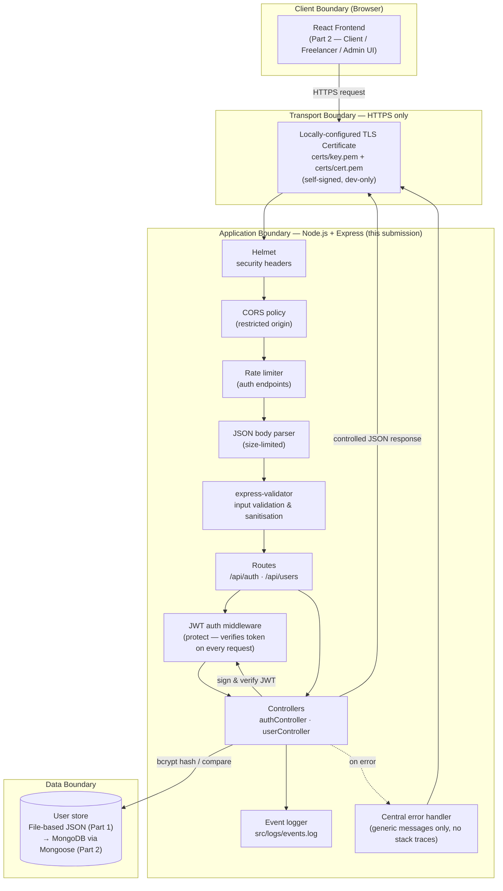

# HustleHub+ — Secure Backend Foundations (Part 1)

**Module:** Information Systems 3D (INSY7314/w) / Application Development Security (APDS7311/w)
**POE Part:** 1 of 3 — Secure Foundations
**Student:** Evanildo Julio Chaves Jose (ST10437401)
**GitHub:** [evanildo26](https://github.com/evanildo26)
**Stack:** MERN (MongoDB · Express · React · Node.js) — Part 1 delivers the secure Express/Node.js backend foundation that the rest of the stack will be built on.

---

## 1. Project Overview

HustleHub+ is a freelance marketplace platform. Freelancers advertise services ("gigs"), clients browse and book them, and the platform records the resulting transactions so that freelancers can track income and get an estimate of their tax liability.

**Intended users:**

| Role | Description |
|---|---|
| **Client** | Browses gigs and books freelancer services. |
| **Freelancer** | Creates and manages gigs, receives bookings, and tracks income/tax estimates. |
| **Admin** | Platform oversight (introduced in later parts). Cannot be created through public self-registration — see [Security Decisions](#4-security-decisions). |

Because HustleHub+ handles credentials, booking/transaction records, and income data, security has been treated as a first-class requirement from this first part onward rather than something added at the end.

**Scope of this submission (Part 1 only):** user registration, login, password hashing, JWT issuance/validation, HTTPS, input validation, and controlled error handling. There is no database, no gig/booking logic, and no frontend yet — those are introduced in Parts 2 and 3 as required by the POE brief. User data is stored in a local JSON file, which the brief explicitly permits at this stage ("user data may be stored locally using an in-memory structure or file-based storage").

---

## 2. Architecture

The diagram below shows the intended full MERN architecture for HustleHub+ and marks which pieces exist today (Part 1, solid) versus what is planned for later parts (React frontend, MongoDB — dashed/noted). It also shows the security controls sitting in the request path and the system's trust boundaries.



**System boundaries shown above:**

- **Client boundary** — the browser/React app. Untrusted; every request from here is treated as potentially hostile input.
- **Transport boundary** — all traffic must cross via HTTPS. There is no HTTP fallback; credentials and JWTs are never sent in plaintext over the network.
- **Application boundary** — the Express server. Every request passes through security headers, CORS, rate limiting, body parsing, and input validation *before* it reaches any business logic. Protected routes additionally require a valid JWT.
- **Data boundary** — the user store. Only the model layer (`src/models/userModel.js`) touches it directly; controllers never read/write the underlying file themselves, which keeps the same boundary intact when this is replaced by MongoDB in Part 2.

---

## 3. Backend Structure

```
hustlehub-backend/
├── server.js                  # HTTPS bootstrap: loads cert, starts the server
├── scripts/
│   └── generateCert.js        # Generates a local self-signed TLS certificate
├── src/
│   ├── app.js                 # Express app: middleware + route wiring
│   ├── config/
│   │   └── env.js             # Centralised env var loading + fail-fast checks
│   ├── routes/
│   │   ├── authRoutes.js      # /api/auth/register, /api/auth/login
│   │   └── userRoutes.js      # /api/users/me (JWT-protected)
│   ├── controllers/
│   │   ├── authController.js  # Registration & login business logic
│   │   └── userController.js  # Protected-route example (get own profile)
│   ├── middleware/
│   │   ├── validators.js      # express-validator rules + error formatting
│   │   ├── authMiddleware.js  # JWT verification (protect) + RBAC hook (restrictTo)
│   │   ├── errorHandler.js    # 404 handler + centralised error responses
│   │   └── rateLimiter.js     # Rate limiting for auth endpoints
│   ├── models/
│   │   └── userModel.js       # File-based user store (single point of data access)
│   ├── utils/
│   │   ├── AppError.js        # Operational-error class
│   │   ├── jwt.js             # sign/verify wrapper around jsonwebtoken
│   │   └── logger.js          # Structured event logging (console + file)
│   ├── data/
│   │   └── users.json         # Runtime user data (git-ignored)
│   └── logs/
│       └── events.log         # Runtime event log (git-ignored)
├── postman/
│   └── HustleHub-Part1.postman_collection.json
├── .env.example
├── .gitignore
└── package.json
```

**Why this layout:** routes only describe *which* URL maps to *which* handler; controllers hold business logic; middleware holds cross-cutting concerns (validation, auth, rate limiting, errors); models are the only code that touches storage. This separation is what lets, for example, the storage layer be swapped for MongoDB in Part 2 without touching a single controller, and lets new protected routes reuse `protect`/`restrictTo` without re-implementing token verification.

---

## 4. Security Decisions

### 4.1 Password Hashing

Passwords are never stored in plain text. On registration, `bcryptjs` hashes the password with a **cost factor of 12** before it is written to storage (`src/controllers/authController.js`); on login, the submitted password is compared against the stored hash with `bcrypt.compare`, which recomputes the hash internally and never exposes the original. bcrypt was chosen because it is a deliberately slow, salted hashing algorithm designed for passwords (unlike fast general-purpose hashes such as SHA-256, which are unsuitable for password storage because they are cheap to brute-force at scale) [1]. A cost factor of 12 is the current OWASP-recommended baseline, balancing resistance to offline brute-force attacks against acceptable login latency [1].

### 4.2 JWT-Based Authentication

On successful login, the server issues a signed JSON Web Token (`src/utils/jwt.js`) containing only non-sensitive claims — `id`, `role`, and `email` — never the password hash [2]. The token is signed with a secret loaded from the environment (`JWT_SECRET`, never hard-coded) and expires after a configurable window (`JWT_EXPIRES_IN`, default 1 hour).

Every subsequent request to a protected route must include this token as `Authorization: Bearer <token>`. The `protect` middleware (`src/middleware/authMiddleware.js`) runs on each such request and:

1. Extracts and verifies the token's signature and expiry against `JWT_SECRET`.
2. Rejects missing, malformed, tampered, or expired tokens with a generic `401`.
3. Confirms the referenced user still exists in the store.
4. Only then attaches `req.user` and allows the request to continue.

This means authentication is **re-validated on every protected request**, not just checked once at login — a stolen or expired token is rejected immediately, and there is no server-side session state to keep in sync. `GET /api/users/me` demonstrates this end-to-end. A `restrictTo(...roles)` helper is already in place alongside `protect` so that role-based access control can be layered on top of specific routes in Part 2 without changing the authentication mechanism itself.

### 4.3 Input Validation & Sanitisation

All input is re-validated **server-side**, using `express-validator`, regardless of what a future frontend might already check — client-side validation is a UX convenience, not a security control, since it can always be bypassed by calling the API directly [4]. Registration enforces: name format/length, a valid email (normalised to lower-case), and a password policy (minimum 8 characters, upper- and lower-case letters, a digit, and a special character). The `role` field is restricted to `client` or `freelancer` — **`admin` cannot be self-assigned through registration**, which closes off a privilege-escalation path that a more permissive implementation would leave open. Requests that fail validation are rejected with `400` before they ever reach a controller or touch storage, and the response only echoes back *which fields* were invalid — never the submitted values that might contain malicious content (e.g. a `<script>` payload is rejected outright rather than stored or reflected).

### 4.4 HTTPS

The API only runs over HTTPS (`server.js`), using a locally generated, self-signed TLS certificate (`npm run generate-cert`, backed by the `selfsigned` package rather than requiring the OpenSSL CLI to be installed). There is no HTTP listener at all, so credentials and tokens can never be sent in plaintext, even accidentally. HTTPS protects the confidentiality and integrity of data in transit — without it, a JWT or password could be captured by anyone able to observe network traffic (e.g. on shared Wi-Fi) [6][7]. In production this self-signed certificate would be replaced with one issued by a trusted Certificate Authority (e.g. Let's Encrypt); the code path is otherwise unchanged.

### 4.5 Controlled Error Handling

All errors flow through a single central handler (`src/middleware/errorHandler.js`). Anticipated ("operational") errors — bad input, wrong credentials, a duplicate email — return their specific, safe message. Anything unexpected (a bug, an unhandled exception) is logged in full detail *server-side only* and the client receives a generic `"Something went wrong. Please try again later."` with no stack trace, file path, or configuration value, in any environment. This directly follows OWASP guidance that verbose error output is an information-disclosure risk an attacker can use to map out the application [3].

### 4.6 Additional Hardening Already in Place

Two further controls were added ahead of when the POE strictly requires them, since they were low-cost to include now and reduce Part 2 workload:

- **Helmet** — sets a solid baseline of security-related HTTP headers (`X-Content-Type-Options`, `X-Frame-Options`, etc.) [8]. A full Content Security Policy is configured in Part 2 once the frontend's asset origins are known.
- **Rate limiting** — `/api/auth/register` and `/api/auth/login` are limited per IP address, reducing the effectiveness of brute-force and credential-stuffing attempts against authentication endpoints [3].

### 4.7 Logging

Registration attempts, login successes/failures, invalid-token attempts, and all request errors are written to `src/logs/events.log` (and mirrored to the console) via `src/utils/logger.js`, with a timestamp and enough context to investigate an incident — but never a password, token, or other secret. This is a first step toward the more comprehensive logging/monitoring the POE requires in Part 3.

---

## 5. Getting Started

### Prerequisites

- [Node.js](https://nodejs.org/) 18 or later (includes `npm`)
- A terminal (Command Prompt, PowerShell, macOS/Linux Terminal, or the integrated terminal in an editor such as **VS Code**)
- [Postman](https://www.postman.com/downloads/) for API testing

> This is a Node.js/JavaScript project, not a .NET project — Visual Studio 2022 is not required. VS Code (free) is the recommended editor for working with it.

### Setup

```bash
# 1. Install dependencies
npm install

# 2. Create your local environment file
cp .env.example .env
# then open .env and set JWT_SECRET to a long random string, e.g.:
node -e "console.log(require('crypto').randomBytes(48).toString('hex'))"

# 3. Generate a local self-signed HTTPS certificate (one-time)
npm run generate-cert

# 4. Start the server
npm start
```

The API will be available at **`https://localhost:5000`** (or whichever `PORT` you set in `.env`). Because the certificate is self-signed, your browser/Postman will show an "untrusted certificate" warning the first time — this is expected for local development. In Postman, disable **Settings → General → SSL certificate verification** before testing against `localhost`.

### Resetting local data

Registered users are stored in `src/data/users.json`. Delete its contents back to `[]` (or delete the file — it will be recreated automatically) to reset to a clean state.

---

## 6. API Reference

| Method | Endpoint | Auth required | Description |
|---|---|---|---|
| GET | `/api/health` | No | Health check |
| POST | `/api/auth/register` | No | Register a new client or freelancer account |
| POST | `/api/auth/login` | No | Log in and receive a JWT |
| GET | `/api/users/me` | **Yes (JWT)** | Return the authenticated user's own profile |

All responses are JSON in the shape `{ "success": boolean, "message"?: string, "data"?: object, "errors"?: [...] }`.

**Example — register:**
```
POST /api/auth/register
{
  "name": "Thandiwe Nkosi",
  "email": "thandiwe@example.com",
  "password": "StrongPass1!",
  "role": "freelancer"
}
```

**Example — login:**
```
POST /api/auth/login
{
  "email": "thandiwe@example.com",
  "password": "StrongPass1!"
}
```

**Example — protected route:**
```
GET /api/users/me
Authorization: Bearer <token returned from login>
```

---

## 7. Testing

A Postman collection is provided at `postman/HustleHub-Part1.postman_collection.json` and covers:

- Health check
- Successful registration
- Duplicate-email registration (409)
- Invalid email / weak password / missing fields (400)
- Rejected self-assigned `admin` role (400)
- Rejected script-injection attempt in the name field (400)
- Successful login (and capture of the JWT into a collection variable)
- Login with the wrong password / a non-existent user (401, identical generic message)
- Protected route with no token / an invalid token / a valid token (401 / 401 / 200)
- Unknown route (404, with a check that no stack trace or file path is leaked)

**To run it:** import the collection into Postman, set the `baseUrl` variable if you changed `PORT`, disable SSL certificate verification for `localhost`, and run the requests top to bottom (the login request stores the JWT automatically for the protected-route requests that follow it). Automated execution via Newman, and an expanded collection covering gigs/bookings, is introduced in Part 2.

---

## 8. What's Next (Part 2 & 3 Preview)

This submission intentionally stops at secure backend foundations, per the POE's incremental structure. Planned for later parts: MongoDB via Mongoose in place of the JSON file store, the React frontend, gig/booking/transaction functionality with full RBAC, a Content Security Policy, Newman-driven CI testing, income/tax calculation and dashboards, Docker containerisation, and a GitHub Actions CI/CD pipeline with static analysis.

---

## 9. References

[1] OWASP Foundation, "Password Storage Cheat Sheet," *OWASP Cheat Sheet Series*, 2023. [Online]. Available: https://cheatsheetseries.owasp.org/cheatsheets/Password_Storage_Cheat_Sheet.html. [Accessed: 27-Jul-2026].

[2] M. Jones, J. Bradley, and N. Sakimura, "JSON Web Token (JWT)," RFC 7519, Internet Engineering Task Force (IETF), May 2015. [Online]. Available: https://www.rfc-editor.org/rfc/rfc7519. [Accessed: 27-Jul-2026].

[3] OWASP Foundation, "OWASP Top Ten," *OWASP*, 2021. [Online]. Available: https://owasp.org/www-project-top-ten/. [Accessed: 27-Jul-2026].

[4] OWASP Foundation, "Input Validation Cheat Sheet," *OWASP Cheat Sheet Series*, 2023. [Online]. Available: https://cheatsheetseries.owasp.org/cheatsheets/Input_Validation_Cheat_Sheet.html. [Accessed: 27-Jul-2026].

[5] OpenJS Foundation, "Express — Node.js Web Application Framework," *Express.js Documentation*, 2024. [Online]. Available: https://expressjs.com/. [Accessed: 27-Jul-2026].

[6] Mozilla Developer Network, "HTTP Strict Transport Security (HSTS)," *MDN Web Docs*, 2024. [Online]. Available: https://developer.mozilla.org/en-US/docs/Web/HTTP/Headers/Strict-Transport-Security. [Accessed: 27-Jul-2026].

[7] Node.js Foundation, "HTTPS," *Node.js Documentation*, 2024. [Online]. Available: https://nodejs.org/api/https.html. [Accessed: 27-Jul-2026].

[8] Helmet.js, "Helmet Documentation," 2024. [Online]. Available: https://helmetjs.github.io/. [Accessed: 27-Jul-2026].
